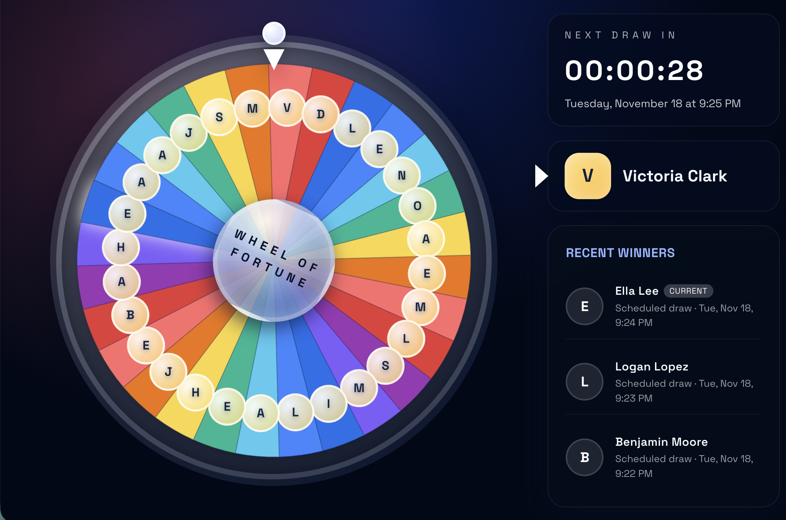

# Fortune Wheel



Browser-based fortune wheel for employee lucky draws. Any slug (sales, ops, tech, etc.) becomes its own game with a rotating roster, scheduled or one-off spins, and a recent-winners feed that stays in sync across devices.

## Highlights

- **Always-on wheel** – SVG wheel idles smoothly, ticks every employee transition, and spins automatically at scheduled draws.
- **Timed celebrations** – Winners trigger a confetti/chime overlay before their names move into the recent list.
- **Multi-game support** – Every slug (e.g. `/aas`, `/office`) has its own roster, schedule, and history in SQLite.
- **Admin console** – `/admin` offers a password-gated UI to create games, pick repeat vs. once-off spins, and bulk-manage employees via comma-separated lists.
- **Snapshot winners** – Names are stored with the draw, so removing employees never retroactively “breaks” history.

## Stack

- Vite + React + Hooks for the kiosk UI
- Express + better-sqlite3 for backend/API/scheduling
- `node-cron` + `cron-parser` for repeat schedules
- Canvas confetti + Web Audio for celebratory effects

## How it Works

1. Visit `/admin`, enter the password from `.env`, and create a game by picking a slug (e.g. `sales`, `ops`, `tech`).
2. Choose a schedule: repeat every minute/hour/day/week, or run once on a specific date/time.
3. Paste comma-separated employee names; the wheel automatically rotates through their initials and snapshots.
4. Display `/<slug>` anywhere (TV, browser tab, etc.). The wheel keeps spinning, plays ticking audio, and automatically reveals winners when the scheduled draw hits.

The backend stores all rosters, schedules, and winners in SQLite and exposes `/api/:slug/...` endpoints for the client. Winners include the name snapshot taken at draw time, so removing employees later never breaks history.

## Production Run

```bash
npm install                   # root/server deps (run once)
npm install --prefix client   # frontend deps (run once)
npm run client:build          # emits client/dist
npm run server                # serves API + built UI on PORT (default 4000)
```

Set any overrides in `.env` (e.g., `PORT`, `ADMIN_PASSWORD`, `VITE_CLIENT_PORT`) before starting the server. Once running, visit `/admin` to configure games and `/<slug>` to display a wheel.
